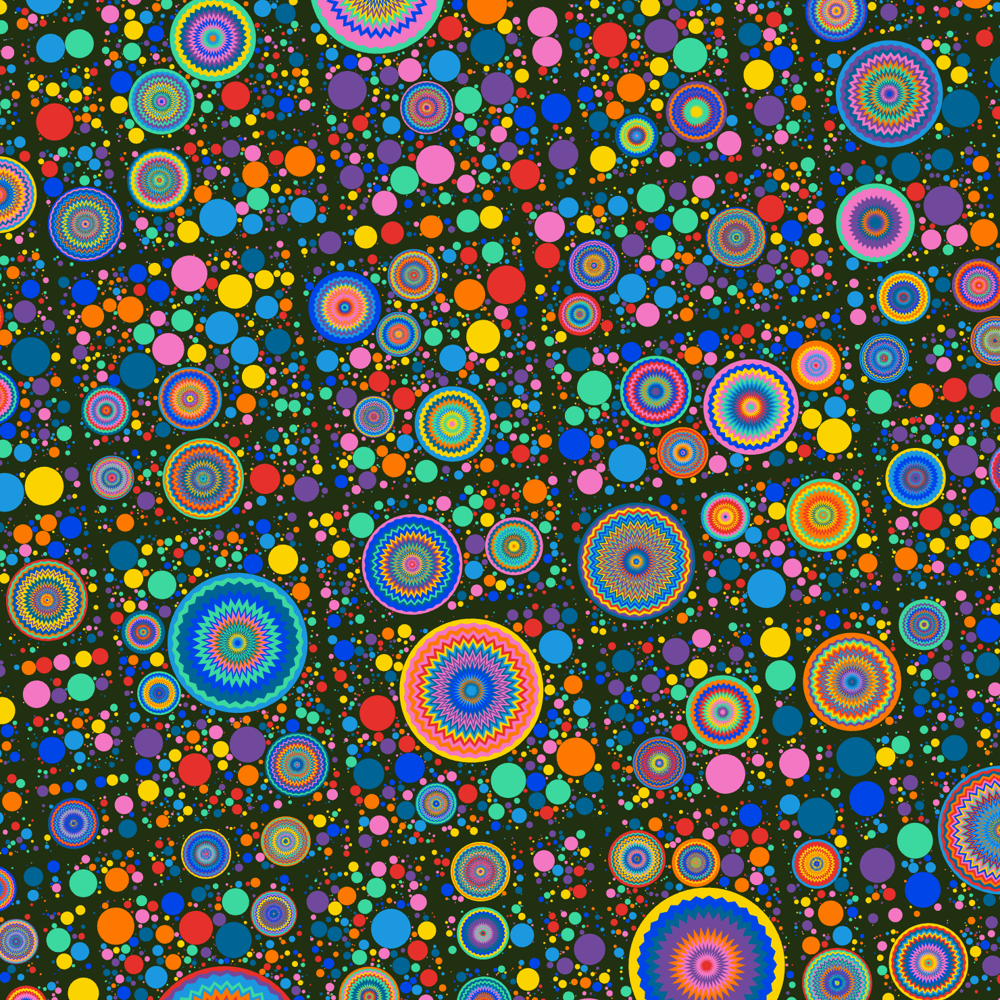

# Creative coding major project
## Group Work

_Wheels of fortune by Pacita Abad_

_Group Work Final edition_

## Indivitual Work
### Instructions
My work uses a time-based approach. After the user enters the page, the shapes on the screen will start to change after a 2-second wait. The larger circular images will grow or shrink over a period of time, while the smaller shapes will also change their forms. After 3 seconds, all the shapes will update their colours and positions.

### Details of my individual work
I chose time to animating my individual work.

**Commit1:**
1. Added **noLoop()** in the **setup()** function.
2. Added a **setTimeout()** function in the **setup()** function: Every time the user enter this interface the animation will start in 2 seconds.
3. Removed The original **noLoop()** from the **draw()** function:

**Commit2:**
1. Added a global variable points to store the generated points.
2. Modified the **draw()** function to animate the points when they exist.
3. Used the **sin()** function to periodically change p.z, making it grow and shrink over a 3-second period.
4. Used **setInterval**(updatePoints, 3000) to update the positions and sizes of the points every 3 seconds.

**Commit3:**
1. Added shape property to each point in the **CirclePacking class**: In the generatePoints method, each point is randomly assigned a shape (circle, triangle, polygon).
2. Modified the **draw()** function to draw different shapes: Depending on the shape property of the point, different shapes are drawn.
3. Added functions to draw triangles and polygons: Added **drawTriangle（）** and **drawPolygon()** functions.
4. Changed the background colour.

**Commit4:**
1. Resized the browser window.

**Inspiration and References**

My inspiration comes from two works. 
One piece of work inspired me about the colour, I wanted the final rendering to be colourful. One piece of work inspired me how to animate, and I wanted to end up with an animation effect that zooms in and out of the image.

_Created by Okazz
_[Click the link](https://openprocessing.org/sketch/2168750)_

_Created by ogadaki_
_[Click the link](https://openprocessing.org/sketch/2268138)_